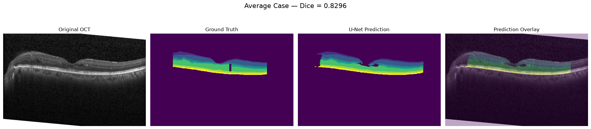
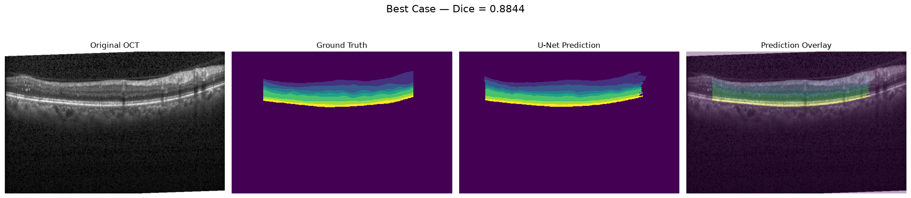
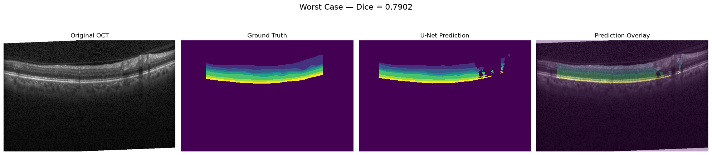

# OCT Retinal Layer Segmentation with PyTorch

An end-to-end computer vision pipeline for automated retinal-layer segmentation from optical coherence tomography (OCT) B-scans using the Duke/Chiu 2015 OCT dataset.

This project was developed as a focused research exercise at the intersection of **optometry, ophthalmic imaging, computer vision and machine learning**, with the goal of building practical experience in quantitative OCT analysis.

## Research objective

OCT provides high-resolution cross-sectional representations of retinal anatomy, but extracting quantitative structural information from these images can require accurate identification of anatomical boundaries.

This project investigates whether a convolutional neural network can learn to segment retinal regions from manually annotated OCT scans, establishing a computational foundation for subsequent quantitative analysis of retinal and posterior-eye geometry.

## Dataset

The project uses the **Duke/Chiu 2015 OCT dataset**, distributed as MATLAB `.mat` files.

Each subject contains:

* 61 OCT B-scans
* 768 A-scan columns per B-scan
* 496 pixels in depth
* Manual retinal-layer boundary annotations from two graders
* Additional automatic and fluid annotations

Only B-scans containing manual layer annotations are used for supervised segmentation.

Across the 10 subjects, the preprocessing pipeline identified **110 manually annotated B-scans**.

## Setup

Dependencies actually used by this codebase: `torch`, `numpy`, `scipy`, `scikit-learn`, `matplotlib`, `tqdm`. There is no `requirements.txt` yet — install these with `pip` in a fresh environment before running the notebooks or `src/training/train.py`.

The Duke dataset (`.mat` files) is not included in this repository; place it under `datasets/duke/2015_BOE_Chiu/` before running the dataset/training notebooks.

## Pipeline

```text
Raw MATLAB .mat files
        │
        ▼
Subject-level data loading
        │
        ▼
Manual boundary extraction
        │
        ▼
8 retinal boundaries
        │
        ▼
8-region pixel-wise segmentation masks
        │
        ▼
Subject-level train/validation split
        │
        ▼
PyTorch Dataset + DataLoader
        │
        ▼
U-Net
        │
        ▼
Retinal-layer segmentation
        │
        ▼
Dice / IoU / Pixel Accuracy
        │
        ▼
Qualitative prediction analysis
```

## Implementation

The project was deliberately structured as modular components rather than a single training script.

```text
src/
├── io.py                 # .mat subject loading
├── masks.py               # boundary annotations -> pixel-wise masks
├── dataset.py              # OCTLayerDataset (PyTorch Dataset)
├── visualization.py
├── models/                 # UNet, DoubleConv, DownBlock, UpBlock
└── training/
    ├── train.py             # training entrypoint
    ├── trainer.py            # train_one_epoch
    ├── evaluate.py            # evaluate
    ├── losses.py               # CrossEntropy / DiceCrossEntropyLoss
    ├── metrics.py               # pixel_accuracy
    ├── loaders.py                # DataLoader construction
    └── split.py                   # subject-level train/val split

notebooks/
├── 01_dataset_exploration.ipynb
├── 02_generate_masks.ipynb
├── 03_preprocessing.ipynb
├── 04_dataloader.ipynb
├── 05_unet_forward_pass.ipynb
├── 06_loss_function.ipynb
├── 07_inference.ipynb
└── 08_evaluation.ipynb
```

### Data handling

`src/io.py`

Loads the raw MATLAB subject files into a predictable subject representation containing:

* OCT images
* manual layer annotations
* optional fluid annotations
* subject metadata
* utilities for identifying annotated scans

### Mask generation

`src/masks.py`

Converts the eight manually annotated retinal boundaries into an eight-region pixel-wise segmentation mask (background plus seven inter-boundary layer regions).

The mask generator was tested across all manually annotated scans and includes safeguards against invalid boundary coordinates that could otherwise produce silent NumPy negative-indexing errors.

### Visualization

`src/visualization.py`

Provides reusable functions for:

* displaying OCT B-scans
* displaying retinal boundaries
* displaying segmentation masks
* overlaying masks on OCT images

### Dataset

`src/dataset.py`

Implements a PyTorch `Dataset` that:

* indexes only annotated B-scans
* supports either manual grader
* normalizes OCT images to `[0,1]`
* returns tensors in CNN-compatible format
* produces integer class-label masks compatible with `CrossEntropyLoss`
* retains subject/scan provenance for debugging

### Model

`src/models/unet.py`

A U-Net architecture implemented from scratch in PyTorch.

Input:

```text
(B, 1, 496, 768)
```

Output:

```text
(B, 8, 496, 768)
```

The eight output classes correspond to background plus the seven retinal layer regions defined by the project's mask convention, derived from the eight annotated boundaries.

### Training

Training uses:

* subject-level train/validation splitting
* PyTorch DataLoader
* Adam optimization
* Cross-Entropy loss
* 20 training epochs

Subject-level splitting was used deliberately to avoid having B-scans from the same subject appear in both training and validation sets.

## Results

### Final baseline model

**U-Net + Cross-Entropy loss**

| Metric         | Validation result |
| -------------- | ----------------: |
| Mean Dice      |        **0.8328** |
| Mean IoU       |        **0.7233** |
| Pixel Accuracy |        **0.9711** |

### Per-layer Dice

| Layer |   Dice |
| ----: | -----: |
|     0 | 0.9899 |
|     1 | 0.8001 |
|     2 | 0.8870 |
|     3 | 0.7587 |
|     4 | 0.7282 |
|     5 | 0.8603 |
|     6 | 0.8299 |
|     7 | 0.8085 |

The strongest segmentation performance occurred for Layer 0, while Layers 3 and 4 were comparatively more challenging.

### Qualitative results

Best (Dice = 0.8844), average (Dice = 0.8296), and worst (Dice = 0.7902) validation cases, each showing the original scan, ground truth, U-Net prediction, and prediction overlay:







## Controlled loss-function experiment

A second experiment replaced Cross-Entropy loss with a combined Dice + Cross-Entropy objective.

| Model                        |  Mean Dice |   Mean IoU | Pixel Accuracy |
| ---------------------------- | ---------: | ---------: | -------------: |
| U-Net + Cross-Entropy        | **0.8328** | **0.7233** |         0.9711 |
| U-Net + Dice + Cross-Entropy |     0.8282 |     0.7188 |     **0.9720** |

The combined loss did not improve the principal segmentation metrics, so the original Cross-Entropy model was retained as the final model.

This controlled comparison also illustrates an important principle of the project: additional model complexity is only retained when it produces measurable improvement.

## Why this project matters

The purpose of the project is not simply to obtain a high segmentation score.

The broader objective is to develop the ability to move from raw ophthalmic imaging data to reproducible quantitative analysis:

**OCT acquisition → image processing → anatomical representation → machine learning → validation → quantitative measurement**

Accurate retinal-layer segmentation can provide a computational foundation for extracting structural measurements from OCT images. Extending this workflow from individual 2D B-scans toward volumetric OCT and geometric analysis represents a natural direction for future research.

## Limitations

This is a focused proof-of-concept rather than a clinically validated system.

Important limitations include:

* relatively small number of manually annotated B-scans
* evaluation on a held-out subset of the same dataset
* 2D rather than volumetric 3D segmentation
* no external dataset validation
* no clinical deployment
* no formal assessment of inter-grader variability

The results should therefore be interpreted as evidence of technical feasibility rather than clinical performance.

## Reproducibility

The repository separates:

```text
data loading
      ↓
preprocessing
      ↓
mask generation
      ↓
dataset construction
      ↓
model training
      ↓
inference
      ↓
evaluation
```

This structure makes individual stages independently testable and allows the segmentation model to be replaced or extended without rewriting the underlying data-processing pipeline.

## Future direction

The most important extension is moving beyond 2D retinal-layer segmentation toward **volumetric OCT analysis and quantitative posterior-eye geometry**.

Potential research directions include:

* 3D OCT volume processing
* robust surface reconstruction
* de-warping and geometric correction
* curvature estimation
* quantitative posterior-eye shape metrics
* external validation
* clinically meaningful biomarker development

## License

Code is released under the MIT License (see `LICENSE`). The Duke SD-OCT dataset is a separate third-party resource — cite Chiu et al., *Biomedical Optics Express* 2015 if you use it in research.

## Author

**Philip Abakah**
Doctor of Optometry
University of Cape Coast, Ghana

Research interests: **vision science, ophthalmic imaging, computer vision, machine learning and computational approaches to eye care.**
